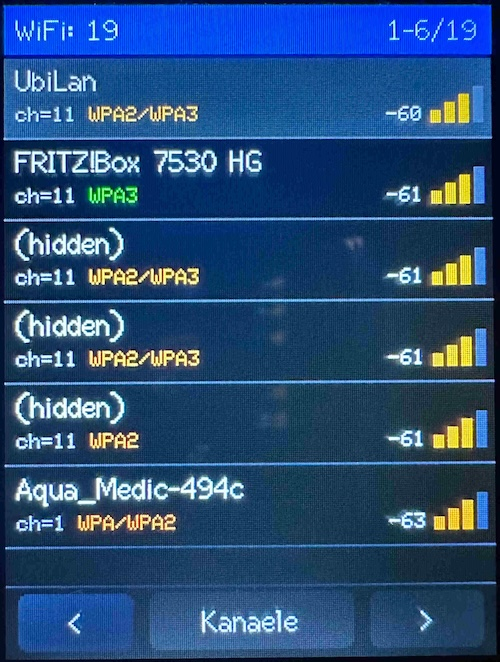
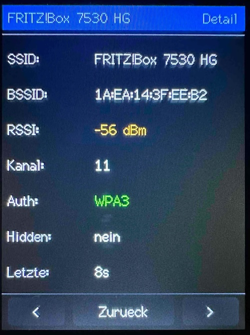
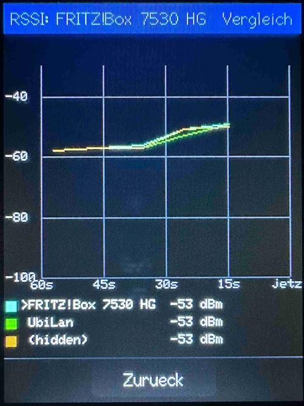
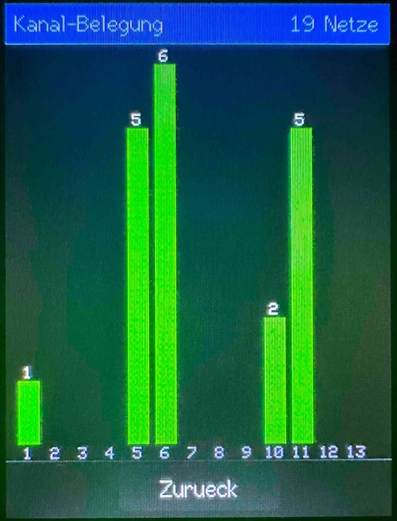

# CYD WiFi-Meter

[](LICENSE)
[](https://platformio.org/)
[](#hardware)
[](https://github.com/DocBigs-Lab/CYD-Wifi-Scanner)
[](#)

Ein WLAN-Scanner für das ESP32-2432S028R ("Cheap Yellow Display", kurz
**CYD**) — zeigt alle sichtbaren 2.4GHz-Netze in der Umgebung mit
Signalstärke, Sicherheitstyp, Kanal und einem Live-Vergleichsgraphen.
Läuft komplett autark auf dem Gerät, kein Smartphone/PC nötig.

## ⚡ Web-Installer

Die Firmware kann **direkt aus dem Browser** geflasht werden — kein
PlatformIO, kein Terminal nötig. Funktioniert in Chrome/Edge (Web Serial
API) auf dem Desktop.

> **👉 [Web-Installer öffnen](https://docbigs-lab.github.io/CYD-Wifi-Scanner/)**


## Hardware

Dieses Projekt ist auf eine **konkrete CYD-Variante** zugeschnitten — "CYD"
("Cheap Yellow Display") ist nur ein Community-Spitzname für eine ganze
Familie ähnlicher ESP32-Boards, die sich in Touch-Technik, Display-Treiber
und Pinout unterscheiden können. Ohne Anpassung läuft dieser Code nur auf
genau dieser Variante zuverlässig:

- **Modell:** `ESP32-2432S028R`, Hardware-Revision **v1/v2/v3**
  (erkennbar am Display-Treiber-Workaround unten)
- **Display:** 2.8″ TFT, 240×320, Controller **ILI9341**, angesteuert über
  `ILI9341_2_DRIVER` statt des generischen `ILI9341_DRIVER` — Letzterer
  führt auf diesem Board zu invertierten Farben (Blau↔Gelb, Grün↔Lila),
  siehe `include/User_Setup.h`
- **Touch:** **resistiv** über einen separaten **XPT2046**-Controller auf
  eigenem SPI-Bus (HSPI) — **nicht** die kapazitiven CYD-Varianten mit
  GT911/CST820-Touch, die ein anderes Touch-Protokoll und andere Pins
  brauchen
- **MCU:** ESP32-WROOM-32, 240 MHz, 320 KB RAM, 4 MB Flash
- Display-Treiber: [TFT_eSPI](https://github.com/Bodmer/TFT_eSPI)
- Touch-Treiber: [XPT2046_Touchscreen](https://github.com/PaulStoffregen/XPT2046_Touchscreen)

Pin-Belegung (Display + Touch) steht in `include/User_Setup.h` bzw.
`src/config.h` — bei einer anderen CYD-Variante (z.B. kapazitiver Touch,
andere Auflösung, "2-USB"-Board mit abweichendem Pinout) müssen diese
beiden Dateien entsprechend angepasst werden.

## Screens

### Liste
Alle gefundenen Netze, stärkstes Signal zuerst. Pro Zeile: SSID, Kanal,
Sicherheitstyp (farbcodiert), RSSI in dBm und Signalbalken (ebenfalls
farbcodiert nach Signalstärke).



### Detail
Tap auf eine Zeile öffnet die Detailansicht: SSID, BSSID (MAC-Adresse),
RSSI, Kanal, Sicherheitstyp, ob das Netz versteckt ist, und wann es
zuletzt gesehen wurde.



### RSSI-Vergleich
Long-Press auf eine Zeile (in Liste oder Detail) öffnet einen Live-Graph,
der die Signalstärke des gewählten Netzes über die letzten 60 Sekunden
zusammen mit den zwei stärksten anderen Netzen in der Umgebung zeigt —
nützlich, um z.B. Störungen oder Schwankungen zu beobachten.



### Kanal-Belegung
Balkendiagramm: wie viele Netze senden auf welchem 2.4GHz-Kanal (1–13).
Hilft, einen wenig belegten Kanal für den eigenen Access Point zu finden.



## Bedienung

Die komplette Navigation läuft über Taps auf Zeilen/Buttons — es gibt
keine Wischgesten.

| Screen   | Footer                         | Aktion |
|----------|---------------------------------|--------|
| Liste    | `<` \| `Kanaele` \| `>`         | Seite vor/zurück blättern, Kanalübersicht öffnen |
| Detail   | `<` \| `Zurueck` \| `>`         | vorheriges/nächstes Netz, zurück zur Liste |
| Vergleich / Kanäle | `Zurueck`            | zurück zum vorherigen Screen |

- **Tap auf eine Zeile** in der Liste öffnet die Detailansicht.
- **Long-Press auf eine Zeile** (Liste oder Detail) öffnet den
  RSSI-Vergleich für dieses Netz.

Farbcodierung (Signalstärke und Sicherheit):

| Farbe | Signalstärke (RSSI) | Sicherheit (Auth) |
|-------|---------------------|--------------------|
| 🟢 Grün  | ≥ −55 dBm (ausgezeichnet) | WPA3 |
| 🟡 Gelb  | −70…−55 dBm (okay)        | WPA / WPA2 / WPA2-Enterprise / WPA2+WPA3-Mixed / WAPI / OWE |
| 🔴 Rot   | < −70 dBm (schwach)       | Offen / WEP |

## Build & Flash

Projekt nutzt [PlatformIO](https://platformio.org/).

```bash
pio run                # kompilieren
pio run -t upload      # auf das Gerät flashen
pio device monitor      # Serial-Log ansehen (115200 baud)
```

`pio run` erzeugt nebenbei automatisch `docs/CYD-WiFi-Meter-merged.bin`
(via `merge_bin.py`) — das von der Web-Installer-Seite verwendete
Komplett-Image. Das ist normal und für `pio run -t upload` nicht nötig,
nur für den Browser-Flasher.

### Touch-Kalibrierung
(für unseren Anwendungsfall genügen die Default-Werte, es besteht kein Handlungsbedarf!)

## Projektstruktur

```
src/
  main.cpp              Setup/Loop, Touch-Handling, Navigation
  config.h              Zentrale Konfiguration (Pins, Farben, Layout, Scan-Parameter)
  ui/
    ui_renderer.cpp/.h   Rendering aller vier Screens
  wifi/
    wifi_scanner.cpp/.h  FreeRTOS-Scan-Task (Core 0) + RSSI-History
    wifi_data.h          Datenstrukturen (WifiNetworkInfo, WifiAuth, ...)
include/
  User_Setup.h           TFT_eSPI-Pin-Konfiguration für das CYD-Display
docs/                    GitHub-Pages-Root: Web-Installer (index.html,
                         manifest.json, *-merged.bin) + Screenshots
merge_bin.py             Post-Build-Hook: erzeugt docs/*-merged.bin
```

Der WLAN-Scan läuft in einem eigenen FreeRTOS-Task auf Core 0, damit die
UI (Core 1) nicht durch die Scan-Wartezeit (synchroner `WiFi.scanNetworks()`,
ca. 2–4 Sekunden) blockiert wird.

## Architektur-Hinweise

- Netze werden über ihre **BSSID** identifiziert, nicht über einen
  Listen-Index — nach jedem Re-Scan wird neu nach RSSI sortiert, ein
  gemerkter Index wäre dann ungültig.
- Layout wird durchgehend **zur Laufzeit gemessen** (`tft.textWidth()`,
  `tft.fontHeight()`) statt mit festen Pixel-Schätzwerten gearbeitet —
  robust gegen Font-/Textlängen-Änderungen.
- Die RSSI-Historie pro Netz ist ein Ring-Buffer mit **LRU-Eviction**
  (ältester Zeitstempel wird zuerst verdrängt), damit ein gerade
  beobachtetes Netz nie versehentlich aus dem Graph fällt.
