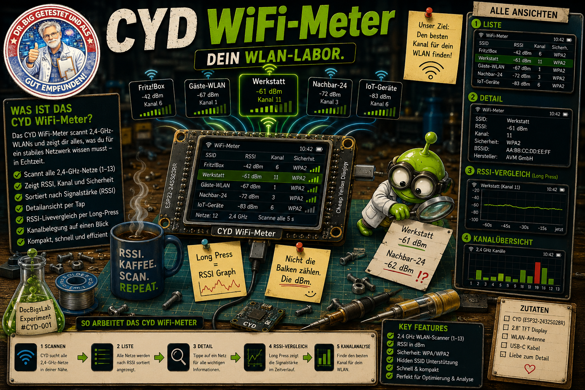

# CYD WiFi-Scanner

[](LICENSE)
[](https://platformio.org/)
[](#hardware)
[](https://github.com/DocBigs-Lab/CYD-Wifi-Scanner)
[](#)



Ein WLAN-Scanner für das ESP32-2432S028R ("Cheap Yellow Display", kurz
**CYD**) — zeigt alle sichtbaren 2.4GHz-Netze in der Umgebung mit
Signalstärke, Sicherheitstyp, Kanal und einem Live-Vergleichsgraphen.
Läuft komplett autark auf dem Gerät, kein Smartphone/PC nötig.

## ⚡ Web-Installer

Die Firmware kann **direkt aus dem Browser** geflasht werden — kein
PlatformIO, kein Terminal nötig. Funktioniert in Chrome/Edge (Web Serial
API) auf dem Desktop.

> **👉 [Web-Installer öffnen](https://docbigs-lab.github.io/CYD-Wifi-Scanner/)**


## Hardware

Dieses Projekt ist auf **zwei konkrete CYD-Varianten** zugeschnitten — "CYD"
("Cheap Yellow Display") ist nur ein Community-Spitzname für eine ganze
Familie ähnlicher ESP32-Boards, die sich in Touch-Technik, Display-Treiber
und Pinout unterscheiden können. Ohne Anpassung läuft dieser Code nur auf
diesen beiden Varianten zuverlässig, beide teilen sich Pinout, Auflösung
und Touch-Technik — sie unterscheiden sich nur im verbauten
Display-Controller:

- **Modell:** `ESP32-2432S028R`
- **Display:** 2.8″ TFT, 240×320 — zwei unterstützte Controller-Varianten:
  - **ILI9341-Variante** (Hardware-Revision **v1/v2/v3**): angesteuert
    über `ILI9341_2_DRIVER` statt des generischen `ILI9341_DRIVER` —
    Letzterer führt auf diesem Board zu invertierten Farben (Blau↔Gelb,
    Grün↔Lila)
  - **ST7789-Variante**: bei manchen CYD-Board-Chargen verbaut (u.a.
    beobachtet bei Boards mit zwei USB-Anschlüssen), angesteuert über
    `ST7789_DRIVER`. **Bestätigter Sonderfall:** das getestete Board
    ignoriert das Hardware-Inversions-Kommando (`TFT_INVERSION_ON`/`OFF`)
    komplett und zeigt jeden Pixel fest bit-invertiert an — lässt sich auf
    Panel-Ebene nicht beheben. Die Firmware kompensiert das stattdessen
    softwareseitig: alle Farbkonstanten werden für `CYD_ST7789`-Builds
    vorab bitweise invertiert (`CYD_COLOR()`-Makro in `src/config.h`),
    sodass die vom Panel nochmals invertierte Ausgabe wieder korrekt
    ankommt. RGB-Reihenfolge/Inversion in `include/User_Setup.h` bleiben
    als zusätzliche, leicht toggelbare Defines erhalten (falls eine andere
    Panel-Charge doch auf das Hardware-Kommando reagiert)
  - Beide Treiberpfade laufen über dieselbe Codebasis, gesteuert per
    Build-Flag `CYD_ST7789` (PlatformIO-Env `cyd-st7789`, siehe unten)
- **Variante erkennen:** Es gibt **kein zuverlässiges äußeres Merkmal** —
  insbesondere ist die **Anzahl der USB-Anschlüsse KEIN verlässliches
  Kriterium**. Einfach eine Variante flashen: passen die Farben, fertig;
  sehen sie falsch/invertiert aus, einfach mit der anderen Variante neu
  flashen — das ist ungefährlich und beliebig oft wiederholbar. Der
  Web-Installer bietet dafür beide Varianten mit einem Klick an. Nach dem
  Flash zeigt das Display beim Boot kurz `Display: ILI9341` bzw.
  `Display: ST7789` (und die Firmware-Version) an, bevor die WLAN-Liste
  erscheint — damit lässt sich direkt am Gerät prüfen, welche Variante
  tatsächlich läuft, ohne Serial-Monitor.
- **Zum Flashen den richtigen USB-Port verwenden:** Bei Boards mit zwei
  USB-Anschlüssen funktioniert das Flashen (Web-Installer wie auch
  `pio run -t upload`) häufig **nur über Micro-USB, nicht über USB-C**
  (bestätigt an einem Testboard) — der USB-C-Port ist auf manchen Chargen
  nicht mit dem UART/Programmier-Chip verbunden. Falls der Browser/PIO das
  Board nicht erkennt: anderen USB-Port probieren.
- **Touch:** **resistiv** über einen separaten **XPT2046**-Controller auf
  eigenem SPI-Bus (HSPI), bei beiden Varianten identisch — **nicht** die
  kapazitiven CYD-Varianten mit GT911/CST820-Touch, die ein anderes
  Touch-Protokoll und andere Pins brauchen
- **MCU:** ESP32-WROOM-32, 240 MHz, 320 KB RAM, 4 MB Flash
- Display-Treiber: [TFT_eSPI](https://github.com/Bodmer/TFT_eSPI)
- Touch-Treiber: [XPT2046_Touchscreen](https://github.com/PaulStoffregen/XPT2046_Touchscreen)

Pin-Belegung (Display + Touch) steht in `include/User_Setup.h` bzw.
`src/config.h` — bei einer anderen CYD-Variante als den beiden oben
genannten (z.B. kapazitiver Touch, andere Auflösung oder abweichendes
Pinout) müssen diese beiden Dateien entsprechend angepasst werden.

## Screens

### Liste
Alle gefundenen Netze, stärkstes Signal zuerst. Pro Zeile: SSID, Kanal,
Sicherheitstyp (farbcodiert), RSSI in dBm und Signalbalken (ebenfalls
farbcodiert nach Signalstärke).


### Detail
Tap auf eine Zeile öffnet die Detailansicht: SSID, BSSID (MAC-Adresse),
RSSI, Kanal, Sicherheitstyp, ob das Netz versteckt ist, und wann es
zuletzt gesehen wurde.


### RSSI-Vergleich
Long-Press auf eine Zeile (in Liste oder Detail) öffnet einen Live-Graph,
der die Signalstärke des gewählten Netzes über die letzten 60 Sekunden
zusammen mit den zwei stärksten anderen Netzen in der Umgebung zeigt —
nützlich, um z.B. Störungen oder Schwankungen zu beobachten.


### Kanal-Belegung
Balkendiagramm: wie viele Netze senden auf welchem 2.4GHz-Kanal (1–13).
Hilft, einen wenig belegten Kanal für den eigenen Access Point zu finden.


## Bedienung

Die komplette Navigation läuft über Taps auf Zeilen/Buttons — es gibt
keine Wischgesten.

| Screen   | Footer                         | Aktion |
|----------|---------------------------------|--------|
| Liste    | `<` \| `Kanaele` \| `>`         | Seite vor/zurück blättern, Kanalübersicht öffnen |
| Detail   | `<` \| `Zurueck` \| `>`         | vorheriges/nächstes Netz, zurück zur Liste |
| Vergleich / Kanäle | `Zurueck`            | zurück zum vorherigen Screen |

- **Tap auf eine Zeile** in der Liste öffnet die Detailansicht.
- **Long-Press auf eine Zeile** (Liste oder Detail) öffnet den
  RSSI-Vergleich für dieses Netz.

Farbcodierung (Signalstärke und Sicherheit):

| Farbe | Signalstärke (RSSI) | Sicherheit (Auth) |
|-------|---------------------|--------------------|
| 🟢 Grün  | ≥ −55 dBm (ausgezeichnet) | WPA3 |
| 🟡 Gelb  | −70…−55 dBm (okay)        | WPA / WPA2 / WPA2-Enterprise / WPA2+WPA3-Mixed / WAPI / OWE |
| 🔴 Rot   | < −70 dBm (schwach)       | Offen / WEP |

## Build & Flash

Projekt nutzt [PlatformIO](https://platformio.org/).

```bash
pio run                          # kompiliert beide Display-Varianten (ILI9341 + ST7789)
pio run -e cyd-st7789 -t upload  # nur die ST7789-Variante flashen
pio run -e esp32dev -t upload    # nur die ILI9341-Variante flashen
pio device monitor               # Serial-Log ansehen (115200 baud)
```

`pio run` erzeugt nebenbei automatisch `docs/CYD-WiFi-Meter-ili9341-merged.bin`
und `docs/CYD-WiFi-Meter-st7789-merged.bin` (via `merge_bin.py`) — die von
der Web-Installer-Seite verwendeten Komplett-Images, je eines pro
Display-Variante. Das ist normal und für `pio run -t upload` nicht nötig,
nur für den Browser-Flasher.

### Touch-Kalibrierung
(für unseren Anwendungsfall genügen die Default-Werte, es besteht kein Handlungsbedarf!)

## Projektstruktur

```
src/
  main.cpp              Setup/Loop, Touch-Handling, Navigation
  config.h              Zentrale Konfiguration (Pins, Farben, Layout, Scan-Parameter)
  ui/
    ui_renderer.cpp/.h   Rendering aller vier Screens
  wifi/
    wifi_scanner.cpp/.h  FreeRTOS-Scan-Task (Core 0) + RSSI-History
    wifi_data.h          Datenstrukturen (WifiNetworkInfo, WifiAuth, ...)
include/
  User_Setup.h           TFT_eSPI-Pin-Konfiguration für das CYD-Display
docs/                    GitHub-Pages-Root: Web-Installer (index.html,
                         manifest-ili9341.json, manifest-st7789.json,
                         *-merged.bin) + Screenshots
merge_bin.py             Post-Build-Hook: erzeugt docs/*-merged.bin
```

Der WLAN-Scan läuft in einem eigenen FreeRTOS-Task auf Core 0, damit die
UI (Core 1) nicht durch die Scan-Wartezeit (synchroner `WiFi.scanNetworks()`,
ca. 2–4 Sekunden) blockiert wird.

## Architektur-Hinweise

- Netze werden über ihre **BSSID** identifiziert, nicht über einen
  Listen-Index — nach jedem Re-Scan wird neu nach RSSI sortiert, ein
  gemerkter Index wäre dann ungültig.
- Layout wird durchgehend **zur Laufzeit gemessen** (`tft.textWidth()`,
  `tft.fontHeight()`) statt mit festen Pixel-Schätzwerten gearbeitet —
  robust gegen Font-/Textlängen-Änderungen.
- Die RSSI-Historie pro Netz ist ein Ring-Buffer mit **LRU-Eviction**
  (ältester Zeitstempel wird zuerst verdrängt), damit ein gerade
  beobachtetes Netz nie versehentlich aus dem Graph fällt.
